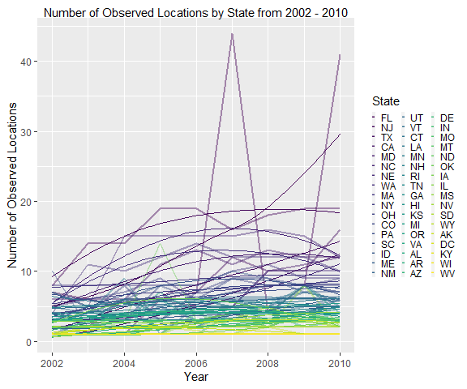
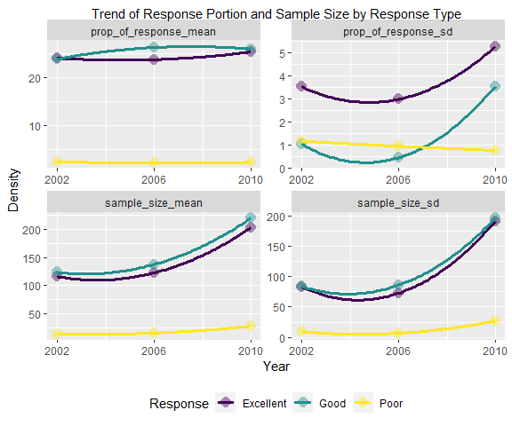

pubh7462\_hw2\_RMD
================
Tsz Fung Wong
January 28,2022

-   [Question 1](#question-1)
-   [Data Description](#data-description)
-   [Q3.3.1](#q331)
-   [Q3.3.2](#q332)
-   [Q3.3.3](#q333)
-   [Q3.3.4](#q334)

# Question 1

``` r
brfss = read_csv("./data/brfss_smart_2010.csv")
brfss_df = as_tibble(brfss) %>%
  janitor::clean_names() %>% #clean names
  filter(topic == "Overall Health") %>%
  select(c("year", "locationabbr", "locationdesc", "response", 
             "sample_size", "response", "data_value")) %>%
    mutate(county = stringr::str_remove(locationdesc, str_flatten(str_c(unique(locationabbr), " - "), "|"))) %>%
  select(-"locationdesc") %>%
  rename("state" = "locationabbr", 
           "prop_of_response" = "data_value") 
brfss_df$response = fct_relevel(factor(brfss_df$response), "Excellent", "Very good", "Good", "Fair")
brfss_df$county = factor(brfss_df$county)
brfss_df$state = factor(brfss_df$state)
```

# Data Description

The modified BRFSS data consist of 10625 observations described with 6
variables measuring overall health conditions. The first variable year
indicate the time of data collection, ranging from 2002 to 2010.
Variable state and county indicate the geographical information of the
observation from 51 states. Response variable indicate the 5 type of
response indicating overall health conditions. Sample\_size variable
indicate the amount of response collected from the specific county for
different type of response. Prop\_of response indicate the proportion of
response accociated with the corresponding type of response.

# Q3.3.1

In year 2004, the states that were observed at 6 locations are AZ, GA,
ID, ME, MI, VT.

# Q3.3.2

``` r
brfss_plot = brfss_df %>%
  filter(year >= '2002' & year <= '2010') %>%
  group_by(year, state) %>%
  summarise(num_location = n_distinct(county)) %>%
  mutate(
    year = year %>%
           as.character() %>%
           as.numeric()
  ) 

brfss_plot %>%
  ggplot(aes(x = year, y = num_location, colour = fct_reorder2(state, year, num_location))) +
  geom_line(size = 1, alpha = 0.44) +
  stat_smooth(alpha = 0.1, 
              size = 0.2, 
              method = "loess",
              span = 2,
              se = FALSE) +
  labs(
    x = "Year",
    y = "Number of Observed Locations",
    title = "Number of Observed Locations by State from 2002 - 2010"
  ) +
  scale_colour_viridis_d("State") +
  theme(legend.position = "right", 
        legend.key.size = unit(0.2, "cm"),
        legend.key.height = unit(0.2, 'cm'),
         legend.key.width = unit(0.05, 'cm'))
```


State NJ has the highest mean number of locations. Most state has low
number of locations observed over time, whereas state FL has two peaks
only in year 2007 and 2010.

# Q3.3.3

``` r
brfss_sum = brfss_df %>%
  filter(year %in% c("2002", "2010", "2006")) %>%
  filter(state %in% c("MN")) %>%
  filter(response %in% c("Excellent", "Good", "Poor")) %>% 
  group_by(county, response) %>%
  summarise(
    across(
      contains(c("sample", "prop")), 
      list(mean = mean, sd = sd), na.rm=TRUE, 
      .names = "{.col}_{.fn}"
    )
  )

brfss_sum  %>%
  gt() %>%
  tab_header("Summary of Sample Size and Proportion of Response")
```

<div id="juusmahwfm" style="overflow-x:auto;overflow-y:auto;width:auto;height:auto;">
<style>html {
  font-family: -apple-system, BlinkMacSystemFont, 'Segoe UI', Roboto, Oxygen, Ubuntu, Cantarell, 'Helvetica Neue', 'Fira Sans', 'Droid Sans', Arial, sans-serif;
}

#juusmahwfm .gt_table {
  display: table;
  border-collapse: collapse;
  margin-left: auto;
  margin-right: auto;
  color: #333333;
  font-size: 16px;
  font-weight: normal;
  font-style: normal;
  background-color: #FFFFFF;
  width: auto;
  border-top-style: solid;
  border-top-width: 2px;
  border-top-color: #A8A8A8;
  border-right-style: none;
  border-right-width: 2px;
  border-right-color: #D3D3D3;
  border-bottom-style: solid;
  border-bottom-width: 2px;
  border-bottom-color: #A8A8A8;
  border-left-style: none;
  border-left-width: 2px;
  border-left-color: #D3D3D3;
}

#juusmahwfm .gt_heading {
  background-color: #FFFFFF;
  text-align: center;
  border-bottom-color: #FFFFFF;
  border-left-style: none;
  border-left-width: 1px;
  border-left-color: #D3D3D3;
  border-right-style: none;
  border-right-width: 1px;
  border-right-color: #D3D3D3;
}

#juusmahwfm .gt_title {
  color: #333333;
  font-size: 125%;
  font-weight: initial;
  padding-top: 4px;
  padding-bottom: 4px;
  border-bottom-color: #FFFFFF;
  border-bottom-width: 0;
}

#juusmahwfm .gt_subtitle {
  color: #333333;
  font-size: 85%;
  font-weight: initial;
  padding-top: 0;
  padding-bottom: 6px;
  border-top-color: #FFFFFF;
  border-top-width: 0;
}

#juusmahwfm .gt_bottom_border {
  border-bottom-style: solid;
  border-bottom-width: 2px;
  border-bottom-color: #D3D3D3;
}

#juusmahwfm .gt_col_headings {
  border-top-style: solid;
  border-top-width: 2px;
  border-top-color: #D3D3D3;
  border-bottom-style: solid;
  border-bottom-width: 2px;
  border-bottom-color: #D3D3D3;
  border-left-style: none;
  border-left-width: 1px;
  border-left-color: #D3D3D3;
  border-right-style: none;
  border-right-width: 1px;
  border-right-color: #D3D3D3;
}

#juusmahwfm .gt_col_heading {
  color: #333333;
  background-color: #FFFFFF;
  font-size: 100%;
  font-weight: normal;
  text-transform: inherit;
  border-left-style: none;
  border-left-width: 1px;
  border-left-color: #D3D3D3;
  border-right-style: none;
  border-right-width: 1px;
  border-right-color: #D3D3D3;
  vertical-align: bottom;
  padding-top: 5px;
  padding-bottom: 6px;
  padding-left: 5px;
  padding-right: 5px;
  overflow-x: hidden;
}

#juusmahwfm .gt_column_spanner_outer {
  color: #333333;
  background-color: #FFFFFF;
  font-size: 100%;
  font-weight: normal;
  text-transform: inherit;
  padding-top: 0;
  padding-bottom: 0;
  padding-left: 4px;
  padding-right: 4px;
}

#juusmahwfm .gt_column_spanner_outer:first-child {
  padding-left: 0;
}

#juusmahwfm .gt_column_spanner_outer:last-child {
  padding-right: 0;
}

#juusmahwfm .gt_column_spanner {
  border-bottom-style: solid;
  border-bottom-width: 2px;
  border-bottom-color: #D3D3D3;
  vertical-align: bottom;
  padding-top: 5px;
  padding-bottom: 5px;
  overflow-x: hidden;
  display: inline-block;
  width: 100%;
}

#juusmahwfm .gt_group_heading {
  padding: 8px;
  color: #333333;
  background-color: #FFFFFF;
  font-size: 100%;
  font-weight: initial;
  text-transform: inherit;
  border-top-style: solid;
  border-top-width: 2px;
  border-top-color: #D3D3D3;
  border-bottom-style: solid;
  border-bottom-width: 2px;
  border-bottom-color: #D3D3D3;
  border-left-style: none;
  border-left-width: 1px;
  border-left-color: #D3D3D3;
  border-right-style: none;
  border-right-width: 1px;
  border-right-color: #D3D3D3;
  vertical-align: middle;
}

#juusmahwfm .gt_empty_group_heading {
  padding: 0.5px;
  color: #333333;
  background-color: #FFFFFF;
  font-size: 100%;
  font-weight: initial;
  border-top-style: solid;
  border-top-width: 2px;
  border-top-color: #D3D3D3;
  border-bottom-style: solid;
  border-bottom-width: 2px;
  border-bottom-color: #D3D3D3;
  vertical-align: middle;
}

#juusmahwfm .gt_from_md > :first-child {
  margin-top: 0;
}

#juusmahwfm .gt_from_md > :last-child {
  margin-bottom: 0;
}

#juusmahwfm .gt_row {
  padding-top: 8px;
  padding-bottom: 8px;
  padding-left: 5px;
  padding-right: 5px;
  margin: 10px;
  border-top-style: solid;
  border-top-width: 1px;
  border-top-color: #D3D3D3;
  border-left-style: none;
  border-left-width: 1px;
  border-left-color: #D3D3D3;
  border-right-style: none;
  border-right-width: 1px;
  border-right-color: #D3D3D3;
  vertical-align: middle;
  overflow-x: hidden;
}

#juusmahwfm .gt_stub {
  color: #333333;
  background-color: #FFFFFF;
  font-size: 100%;
  font-weight: initial;
  text-transform: inherit;
  border-right-style: solid;
  border-right-width: 2px;
  border-right-color: #D3D3D3;
  padding-left: 12px;
}

#juusmahwfm .gt_summary_row {
  color: #333333;
  background-color: #FFFFFF;
  text-transform: inherit;
  padding-top: 8px;
  padding-bottom: 8px;
  padding-left: 5px;
  padding-right: 5px;
}

#juusmahwfm .gt_first_summary_row {
  padding-top: 8px;
  padding-bottom: 8px;
  padding-left: 5px;
  padding-right: 5px;
  border-top-style: solid;
  border-top-width: 2px;
  border-top-color: #D3D3D3;
}

#juusmahwfm .gt_grand_summary_row {
  color: #333333;
  background-color: #FFFFFF;
  text-transform: inherit;
  padding-top: 8px;
  padding-bottom: 8px;
  padding-left: 5px;
  padding-right: 5px;
}

#juusmahwfm .gt_first_grand_summary_row {
  padding-top: 8px;
  padding-bottom: 8px;
  padding-left: 5px;
  padding-right: 5px;
  border-top-style: double;
  border-top-width: 6px;
  border-top-color: #D3D3D3;
}

#juusmahwfm .gt_striped {
  background-color: rgba(128, 128, 128, 0.05);
}

#juusmahwfm .gt_table_body {
  border-top-style: solid;
  border-top-width: 2px;
  border-top-color: #D3D3D3;
  border-bottom-style: solid;
  border-bottom-width: 2px;
  border-bottom-color: #D3D3D3;
}

#juusmahwfm .gt_footnotes {
  color: #333333;
  background-color: #FFFFFF;
  border-bottom-style: none;
  border-bottom-width: 2px;
  border-bottom-color: #D3D3D3;
  border-left-style: none;
  border-left-width: 2px;
  border-left-color: #D3D3D3;
  border-right-style: none;
  border-right-width: 2px;
  border-right-color: #D3D3D3;
}

#juusmahwfm .gt_footnote {
  margin: 0px;
  font-size: 90%;
  padding: 4px;
}

#juusmahwfm .gt_sourcenotes {
  color: #333333;
  background-color: #FFFFFF;
  border-bottom-style: none;
  border-bottom-width: 2px;
  border-bottom-color: #D3D3D3;
  border-left-style: none;
  border-left-width: 2px;
  border-left-color: #D3D3D3;
  border-right-style: none;
  border-right-width: 2px;
  border-right-color: #D3D3D3;
}

#juusmahwfm .gt_sourcenote {
  font-size: 90%;
  padding: 4px;
}

#juusmahwfm .gt_left {
  text-align: left;
}

#juusmahwfm .gt_center {
  text-align: center;
}

#juusmahwfm .gt_right {
  text-align: right;
  font-variant-numeric: tabular-nums;
}

#juusmahwfm .gt_font_normal {
  font-weight: normal;
}

#juusmahwfm .gt_font_bold {
  font-weight: bold;
}

#juusmahwfm .gt_font_italic {
  font-style: italic;
}

#juusmahwfm .gt_super {
  font-size: 65%;
}

#juusmahwfm .gt_footnote_marks {
  font-style: italic;
  font-weight: normal;
  font-size: 65%;
}
</style>
<table class="gt_table">
  <thead class="gt_header">
    <tr>
      <th colspan="5" class="gt_heading gt_title gt_font_normal gt_bottom_border" style>Summary of Sample Size and Proportion of Response</th>
    </tr>
    
  </thead>
  <thead class="gt_col_headings">
    <tr>
      <th class="gt_col_heading gt_columns_bottom_border gt_center" rowspan="1" colspan="1">response</th>
      <th class="gt_col_heading gt_columns_bottom_border gt_right" rowspan="1" colspan="1">sample_size_mean</th>
      <th class="gt_col_heading gt_columns_bottom_border gt_right" rowspan="1" colspan="1">sample_size_sd</th>
      <th class="gt_col_heading gt_columns_bottom_border gt_right" rowspan="1" colspan="1">prop_of_response_mean</th>
      <th class="gt_col_heading gt_columns_bottom_border gt_right" rowspan="1" colspan="1">prop_of_response_sd</th>
    </tr>
  </thead>
  <tbody class="gt_table_body">
    <tr class="gt_group_heading_row">
      <td colspan="5" class="gt_group_heading">Anoka County</td>
    </tr>
    <tr><td class="gt_row gt_center">Excellent</td>
<td class="gt_row gt_right">70.50</td>
<td class="gt_row gt_right">24.7487</td>
<td class="gt_row gt_right">22.300</td>
<td class="gt_row gt_right">4.8083</td></tr>
    <tr><td class="gt_row gt_center">Good</td>
<td class="gt_row gt_right">91.00</td>
<td class="gt_row gt_right">42.4264</td>
<td class="gt_row gt_right">25.300</td>
<td class="gt_row gt_right">4.1012</td></tr>
    <tr><td class="gt_row gt_center">Poor</td>
<td class="gt_row gt_right">10.50</td>
<td class="gt_row gt_right">10.6066</td>
<td class="gt_row gt_right">2.150</td>
<td class="gt_row gt_right">1.9092</td></tr>
    <tr class="gt_group_heading_row">
      <td colspan="5" class="gt_group_heading">Dakota County</td>
    </tr>
    <tr><td class="gt_row gt_center">Excellent</td>
<td class="gt_row gt_right">91.00</td>
<td class="gt_row gt_right">39.9500</td>
<td class="gt_row gt_right">23.300</td>
<td class="gt_row gt_right">2.2338</td></tr>
    <tr><td class="gt_row gt_center">Good</td>
<td class="gt_row gt_right">91.00</td>
<td class="gt_row gt_right">27.7308</td>
<td class="gt_row gt_right">23.633</td>
<td class="gt_row gt_right">2.9484</td></tr>
    <tr><td class="gt_row gt_center">Poor</td>
<td class="gt_row gt_right">10.67</td>
<td class="gt_row gt_right">0.5774</td>
<td class="gt_row gt_right">2.567</td>
<td class="gt_row gt_right">0.8021</td></tr>
    <tr class="gt_group_heading_row">
      <td colspan="5" class="gt_group_heading">Hennepin County</td>
    </tr>
    <tr><td class="gt_row gt_center">Excellent</td>
<td class="gt_row gt_right">324.67</td>
<td class="gt_row gt_right">181.1749</td>
<td class="gt_row gt_right">27.100</td>
<td class="gt_row gt_right">5.4286</td></tr>
    <tr><td class="gt_row gt_center">Good</td>
<td class="gt_row gt_right">344.33</td>
<td class="gt_row gt_right">179.9287</td>
<td class="gt_row gt_right">25.767</td>
<td class="gt_row gt_right">1.3051</td></tr>
    <tr><td class="gt_row gt_center">Poor</td>
<td class="gt_row gt_right">40.67</td>
<td class="gt_row gt_right">28.0416</td>
<td class="gt_row gt_right">2.133</td>
<td class="gt_row gt_right">0.5132</td></tr>
    <tr class="gt_group_heading_row">
      <td colspan="5" class="gt_group_heading">Ramsey County</td>
    </tr>
    <tr><td class="gt_row gt_center">Excellent</td>
<td class="gt_row gt_right">132.00</td>
<td class="gt_row gt_right">54.6168</td>
<td class="gt_row gt_right">24.267</td>
<td class="gt_row gt_right">4.5709</td></tr>
    <tr><td class="gt_row gt_center">Good</td>
<td class="gt_row gt_right">151.33</td>
<td class="gt_row gt_right">76.0548</td>
<td class="gt_row gt_right">26.800</td>
<td class="gt_row gt_right">2.6230</td></tr>
    <tr><td class="gt_row gt_center">Poor</td>
<td class="gt_row gt_right">19.00</td>
<td class="gt_row gt_right">10.5830</td>
<td class="gt_row gt_right">2.733</td>
<td class="gt_row gt_right">0.9018</td></tr>
    <tr class="gt_group_heading_row">
      <td colspan="5" class="gt_group_heading">Washington County</td>
    </tr>
    <tr><td class="gt_row gt_center">Excellent</td>
<td class="gt_row gt_right">66.00</td>
<td class="gt_row gt_right">NA</td>
<td class="gt_row gt_right">26.700</td>
<td class="gt_row gt_right">NA</td></tr>
    <tr><td class="gt_row gt_center">Good</td>
<td class="gt_row gt_right">65.00</td>
<td class="gt_row gt_right">NA</td>
<td class="gt_row gt_right">25.900</td>
<td class="gt_row gt_right">NA</td></tr>
    <tr><td class="gt_row gt_center">Poor</td>
<td class="gt_row gt_right">5.00</td>
<td class="gt_row gt_right">NA</td>
<td class="gt_row gt_right">1.700</td>
<td class="gt_row gt_right">NA</td></tr>
  </tbody>
  
  
</table>
</div>

More above average overall health people are sampled, and they tends to
have higher response rate than the people with poor health condition. As
Washington county only has one year of observation, thus standard
deviation would be NA.

# Q3.3.4

Response distribution of MN

``` r
base.gg = brfss_sum %>% 
  pivot_longer(-c(county, response),
  names_to = "type",
  values_to = "value"
  ) %>%
  group_by(county, response) %>%
  ggplot(aes(x = value, colour = response, fill = response)) +
  geom_histogram(aes(y = stat(density)),
                 binwidth = 100, colour = "black",
                 alpha = 0.24, position = "stack") +
  geom_density(adjust = 2, alpha = 0.44, position = "stack") +
  labs(
  x = "Number",
  y = "Density",
  title = "Distribution of Response Portion and Sample Size by Response Type"
  ) +
  scale_colour_viridis_d("type") +
  scale_fill_viridis_d("type") + 
  xlim(0, NA)
  
event_type.gg <- base.gg + facet_wrap(~ type, scales = "free")
event_type.gg
```


